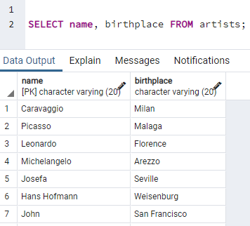
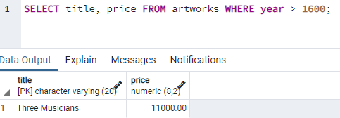
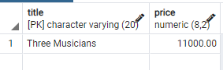
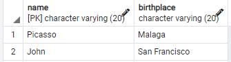
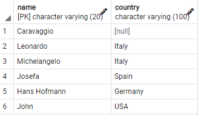
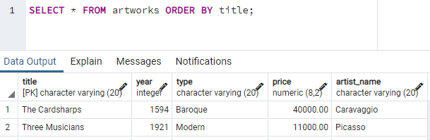
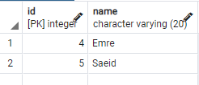
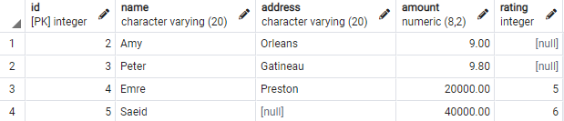

# csi2532_playground

| Outline | Value |
| --- | --- |
| Course | CSI 2532 |
| Date | Winter 2022 |
| Professor | Dorra Riahi, driahi@uottawa.ca |
| TA | Laith Grira, lgrir057@uottawa.ca |
| Team | Marianne Dery 300142817 |

## LAB 6

### Set up

To get ready for the lab, we executed the following commands:

```SQL
CREATE TABLE artists (
	name VARCHAR(20),
	birthplace VARCHAR(20),
	style VARCHAR(20),
	dateofbirth DATE,
	PRIMARY KEY (name)
);

CREATE TABLE customers (
    id INTEGER,
    name VARCHAR(20),
    address VARCHAR(20),
    amount numeric(8,2),
    PRIMARY KEY (id)
);

CREATE TABLE artworks (
    title VARCHAR(20),
    year INTEGER,
    type VARCHAR(20),
    price numeric(8,2),
    artist_name VARCHAR(20),
    PRIMARY KEY (title),
    FOREIGN KEY(artist_name) REFERENCES artists(name)
);

CREATE TABLE likeartists (
    customer_id INTEGER,
    artist_name VARCHAR(20),
    PRIMARY KEY(artist_name, customer_id),
    FOREIGN KEY (artist_name) REFERENCES artists(name),
    FOREIGN KEY (customer_id) REFERENCES customers(id)
);

INSERT INTO customers
	(id, name, address, amount)
VALUES
	(1, 'John', 'Ottawa', 8.5),
	(2, 'Amy', 'Orleans', 9.0),
	(3, 'Peter', 'Gatineau', 6.3);
	
INSERT INTO artists
	(name, birthplace, style, dateofbirth)
VALUES
	('Caravaggio', 'Milan', 'Baroque', '1571-09-28' ),
	('Smith', 'Ottawa', 'Modern', '1977-12-12'),
	('Picasso', 'Malaga', 'Cubism', '1881-10-25');

INSERT INTO artworks
	(title, year, type, price, artist_name)
VALUES
	('Blue', 2000, 'Modern', 10000.00, 'Smith'),
	('The Cardsharps', 1594, 'Baroque', 40000.00, 'Caravaggio');

UPDATE customers
SET amount = 9.8
WHERE address = 'Gatineau';

DELETE
FROM customers
WHERE name = 'John';

ALTER TABLE artists
ADD COLUMN country varchar(100);

ALTER TABLE customers
ADD COLUMN rating integer CHECK (rating between 1 and 10);

INSERT INTO customers
	(id, name, address, amount, rating)
VALUES
	(4, 'Emre', 'Preston', 20000.00, 5),
	(5, 'Saeid', null, 40000.00, 6);

INSERT INTO artists
	(name, birthplace, style, dateofbirth, country)
VALUES
	('Leonardo', 'Florence', 'Renaissance', '1542-04-15', 'Italy'),
	('Michelangelo', 'Arezzo', 'Renaissance', '1475-03-06', 'Italy'),
	('Josefa', 'Seville', 'Baroque', '1630-09-09', 'Spain'),
	('Hans Hofmann', 'Weisenburg', 'Modern', '1966-02-17', 'Germany'),
	('John', 'San Francisco', 'Modern', '1920-02-17', 'USA');

INSERT INTO artworks
	(title, year, type, price, artist_name)
VALUES
('Waves', 2000, null, 4000.00, 'Smith'),
('Three Musicians', 1921, 'Modern', 11000.00, 'Picasso');

INSERT INTO likeartists
	(customer_id, artist_name)
VALUES
	(4, 'Picasso'),
	(5, 'Picasso'),
	(5, 'Leonardo');

BEGIN;

ALTER TABLE artworks
DROP CONSTRAINT artworks_artist_name_fkey;

ALTER TABLE artworks
ADD CONSTRAINT artworks_artist_name_fkey
FOREIGN KEY (artist_name) REFERENCES artists(name)
ON DELETE CASCADE
ON UPDATE CASCADE;

COMMIT;

DELETE
FROM artists
WHERE name = 'Smith';
```

### Exercices

**1.** Lister les name et birthplace de tous les artists 

```SQL
SELECT name, birthplace FROM artists;
```



**2.** Lister le title et le price de toutes les artworks après 1600

```SQL
SELECT title, price FROM artworks WHERE year > 1600;
```



**3.** Lister le title et le type de toutes les artworks qui ont été peintes en 2000 ou peintes par Picasso

```SQL
SELECT title, price FROM artworks WHERE year = 2000 OR artist_name='Picasso';
```


**4.** Lister les name et birthplace de tous les artists nés entre 1880 et 1930. (ASTUCE: EXTRACT(YEAR FROM dateofbirth) vous donne l'année à partir d'un attribut DATE)

```SQL
SELECT name, birthplace FROM artists WHERE EXTRACT(YEAR FROM dateofbirth) BETWEEN 1880 AND 1930;
```



**5.** . Lister les name et le country de naissance de tous les artists dont le style de peinture est Modern, Baroque or Renaissance. (ASTUCE: utilisez le mot-clé IN).

```SQL
SELECT name, country FROM artists WHERE style IN ('Modern', 'Baroque', 'Renaissance');
```



**6.** Lister tous les détails des artworks dans la base de données, triés par title.

```SQL
SELECT * FROM artworks ORDER BY title;
```



**7.** Lister les name et les customer ids de tous les customers qui aiment Picasso.

```SQL
SELECT c.id, c.name
FROM customers c, likeartists l
WHERE c.id = l.customer_id AND artist_name='Picasso';
```



**8.** Lister les name de tous les customers qui aiment les artistes de style Renaissance et dont le price est supérieur à 30000.

```SQL
SELECT c.name
FROM customers c, likeartists l, artists a
WHERE c.id = l.customer_id AND l.artist_name = a.name AND  a.style='Renaissance' AND c.amount > 30000;
```



