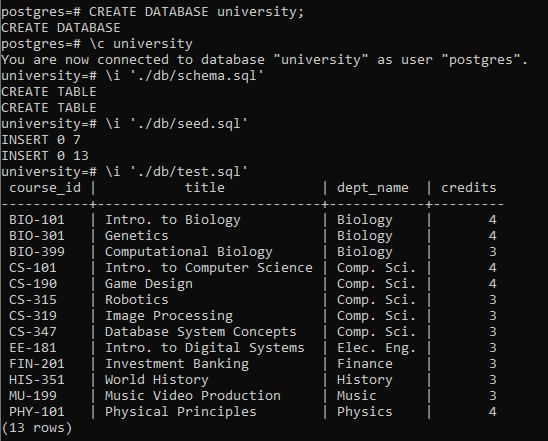

# csi2532_playground

| Outline | Value |
| --- | --- |
| Course | CSI 2532 |
| Date | Winter 2022 |
| Professor | Dorra Riahi, driahi@uottawa.ca |
| TA | Laith Grira, lgrir057@uottawa.ca |
| Team | Marianne Dery 300142817 |

## Lab 2

### Requirements

- Windows OS
- postgresql

### Execution

Go to the project of the folder.

Commands to execute in the command line:

```psql
psql -U <user>
# DROP DATABASE university;
CREATE DATABASE university;
\c university
\i './db/schema.sql'
\i './db/seed.sql'
\i './db/test.sql'
```

### Results


