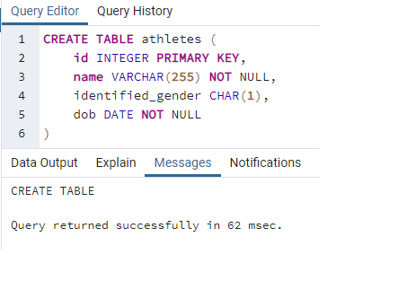
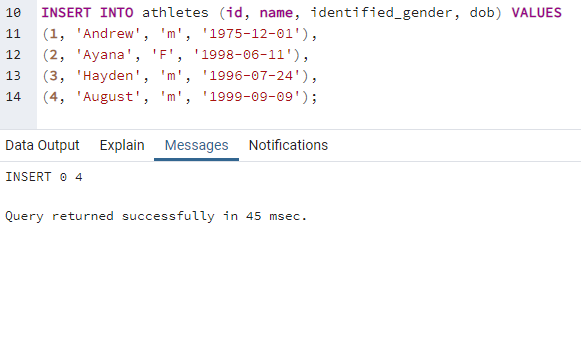
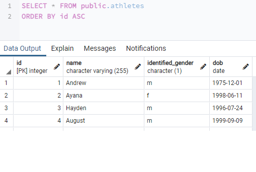
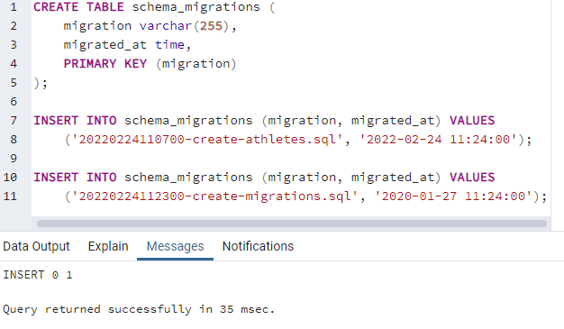
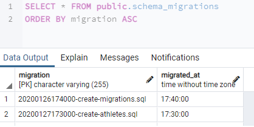
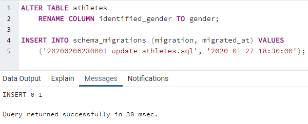
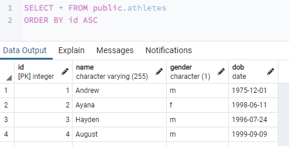
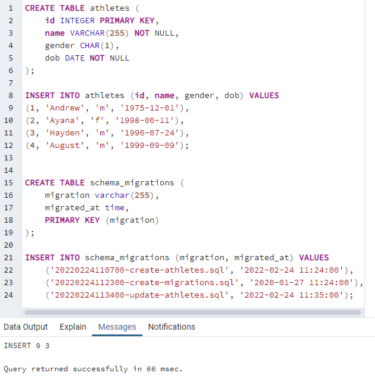
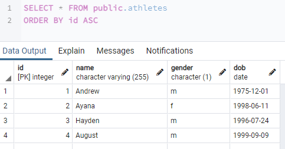

# csi2532_playground

| Outline | Value |
| --- | --- |
| Course | CSI 2532 |
| Date | Winter 2022 |
| Professor | Dorra Riahi, driahi@uottawa.ca |
| TA | Laith Grira, lgrir057@uottawa.ca |
| Team | Marianne Dery 300142817 |

## Lab 5

### Create athletes table

First, we created the table.

Then we added data to the table.

This is the resulting table.

We added those sql commands to the create athletes migration file as well as the schema.

### Create migration table

Then, we added a table to track the migrations.

This is the resulting table.

We mirrored those changes in the schema.

### Update athletes table

Afterwards, we updated the athlete table.

This is the resulting table.

Once again, those changes were mirrored in the schema.

### Schema testing

Finally, we tested our schema to make sure it reflects all the migrations.

This is the resulting athletes table. It is up to date.

