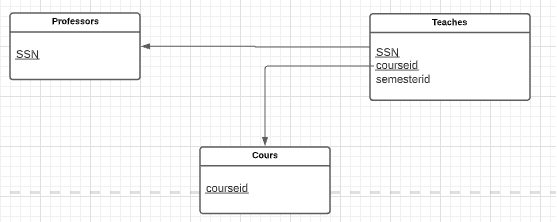
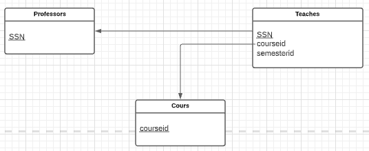
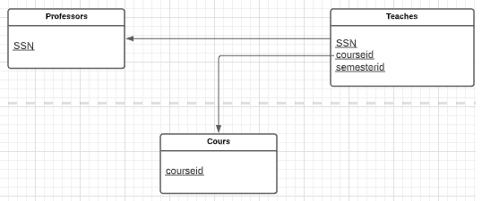
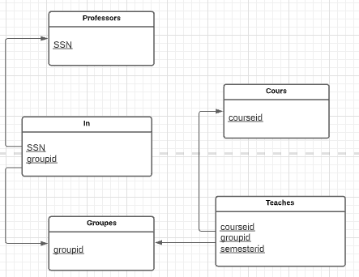

# csi2532_playground

| Outline | Value |
| --- | --- |
| Course | CSI 2532 |
| Date | Winter 2022 |
| Professor | Dorra Riahi, driahi@uottawa.ca |
| TA | Laith Grira, lgrir057@uottawa.ca |
| Team | Marianne Dery 300142817 |

## Lab 4

### Question 1



Table Professors

```SQL
CREATE TABLE Professors
	(SSN INTEGER PRIMARY KEY);

Table Course

```

Table Course

```SQL
CREATE TABLE Course
	(courseid CHAR(7) PRIMARY KEY);
```

Table Teaches

```SQL
CREATE TABLE Teaches
	(SSN INTEGER,
	 courseid CHAR(7),
	 semesterid VARCHAR(100),
	 PRIMARY KEY (SSN, courseid),
	 FOREIGN KEY (SSN) REFERENCES Professors,
	 FOREIGN KEY (courseid) REFERENCES Course
	);
```

### Question 3



Table Professors

```SQL
CREATE TABLE Professors
	(SSN INTEGER PRIMARY KEY);
```

Table Course

```SQL
CREATE TABLE Course
	(courseid CHAR(7) PRIMARY KEY);
```

Table Teaches

```SQL
CREATE TABLE Teaches
	(SSN INTEGER,
	 courseid CHAR(7),
	 semesterid VARCHAR(100),
	 PRIMARY KEY (SSN),
	 FOREIGN KEY (SSN) REFERENCES Professors,
	 FOREIGN KEY (courseid) REFERENCES Course
	);
```

### Question 5



Table Professors

```SQL
CREATE TABLE Professors
	(SSN INTEGER PRIMARY KEY);
```

Table Course

```SQL
CREATE TABLE Course
	(courseid CHAR(7) PRIMARY KEY);
```

Table Teaches

```SQL
CREATE TABLE Teaches
	(SSN INTEGER,
	 courseid CHAR(7),
	 semesterid VARCHAR(100),
	 PRIMARY KEY (SSN, courseid, semesterid),
	 FOREIGN KEY (SSN) REFERENCES Professors,
	 FOREIGN KEY (courseid) REFERENCES Course
	);
```

### Question 6



Table Professors

```SQL
CREATE TABLE Professors
	(SSN INTEGER PRIMARY KEY);
```

Table Course

```SQL
CREATE TABLE Course
	(courseid CHAR(7) PRIMARY KEY);
```

Table Groups

```SQL
CREATE TABLE Groups
	(groupid INTEGER PRIMARY KEY);
```

Table In

```SQL
CREATE TABLE "In"
	(SSN INTEGER,
	 groupid INTEGER,
	 PRIMARY KEY(SSN, groupid),
	 FOREIGN KEY(SSN) REFERENCES Professors,
	 FOREIGN KEY(groupid) REFERENCES Groups
	);
```

Table Teaches

```SQL
CREATE TABLE Teaches
	(courseid CHAR(7),
	 groupid INTEGER,
	 semesterid VARCHAR(100),
	 PRIMARY KEY(courseid, groupid, semesterid),
	 FOREIGN KEY(courseid) REFERENCES Course,
	 FOREIGN KEY(groupid) REFERENCES Groups
	 );
```